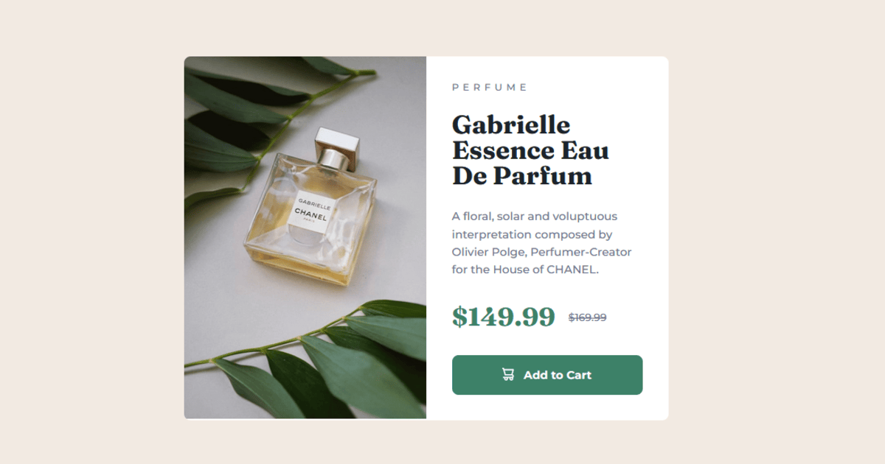

# Cardo

The **Product Page** project. The goal is to build a responsive product card page based on solved test using HTML and CSS, while learning layout techniques, Flexbox, accessibility.

---

## Demo

Live demo: [DEMO](https://kamil-engineer.github.io/perfume/)

---

## Features

- Responsive layout for desktop, tablet, and mobile
- Perfumer styling with html semantic.
- Clean and user-friendly design, following Frontend Mentor Figma

---

## Technologies

- **HTML5** – semantic structure
- **CSS3** – layout (Flexbox / Grid), responsive styles, typography, colors

## What i Learned

- Practising with HTML & CSS & figma.
- Getting very easy with some tasks like this, feeling strong.
- Learn about picture and source.

## Author

[Kamil] kamil-engineer
GitHub: https://github.com/kamil-engineer
